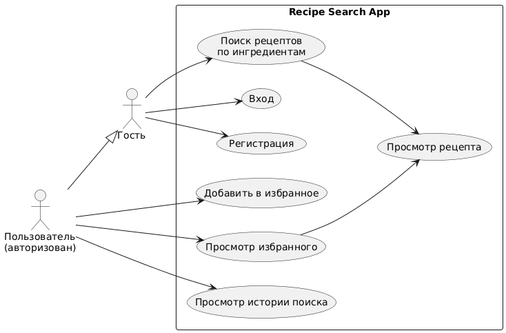
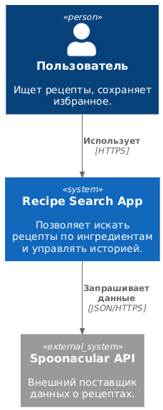
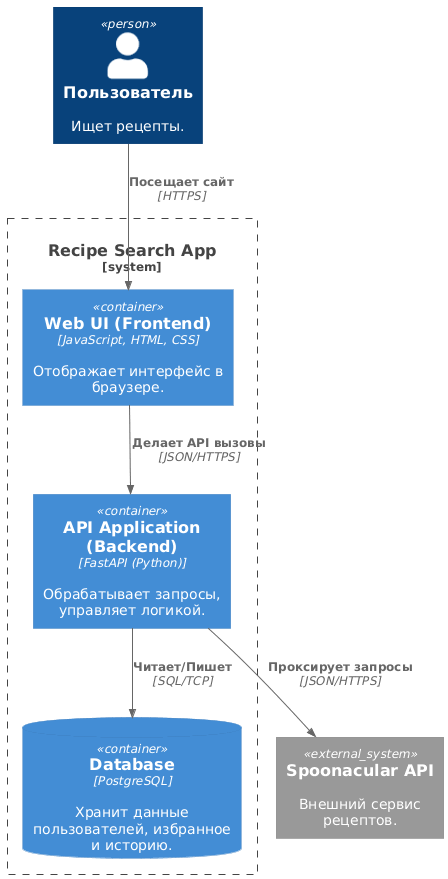
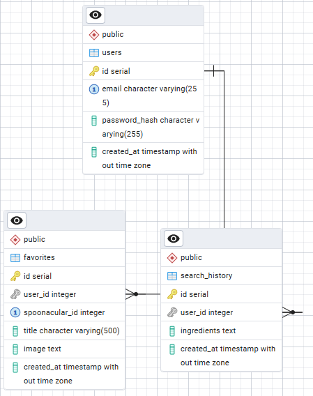

# Recipe Search App

Проект по подбору рецептов на основе имеющихся ингредиентов с использованием Spoonacular API.

**Участники проекта:**
- Сайфутдинов Максим Сергеевич, группа 5130904/30102
- Костушевич Евгения Александровна, группа 5130904/30102
- Бриль Николина Николаевна, группа 5130904/30102

---

## 1. Определение проблемы
Людям сложно быстро подобрать рецепты из имеющихся ингредиентов и понять, что приготовить, не переключаясь между разными сервисами. Без сохранения избранного и истории поиска пользователи вынуждены повторно вводить одни и те же запросы.

## 2. Выработка требований

### Пользовательские истории
- **US1 — Поиск по ингредиентам**: Как пользователь, я хочу ввести список продуктов и получить список подходящих рецептов, чтобы быстро выбрать блюдо.
- **US2 — Детали рецепта**: Как пользователь, я хочу видеть подробную информацию (инструкции, фото), чтобы оценить сложность приготовления.
- **US3 — Персональные разделы**: Как авторизованный пользователь, я хочу сохранять рецепты в избранное и видеть историю поисков для быстрого доступа к ним позже.

### UML Диаграмма прецедентов

## 3. Разработка архитектуры и проектирование

### Характер нагрузки (на 10 000 пользователей в сутки)
- **R/W нагрузка на БД**: ~80% запись (история, избранное) / 20% чтение. Ожидается ~100 000 операций в сутки.
- **Трафик**: ~250 000 запросов к Spoonacular API в сутки (в среднем 2.9 RPS).
- **Объем данных**: При хранении за 5 лет ожидается объем БД около 61 Гб.

### Диаграммы C4
- **Context**

- **Container**

### Контракты API
#### Поиск
- Эндпоинт: GET /api/search
- Параметры: ingredients (строка, ингредиенты через запятую).
- Описание: Проксирует запрос к Spoonacular API и сохраняет поисковый запрос в историю авторизованного пользователя.
- Пример ответа:
`{
  "count": 1,
  "results": [
    {
      "id": 641803,
      "title": "Easy & Delicious Pizza Dough",
      "image": "https://spoonacular.com/recipeImages/641803-312x231.jpg",
      "usedIngredientCount": 1
    }
  ]
}`
#### Избранное
- Эндпоинт: `GET /api/favorites`
- Заголовок: `Authorization: Bearer <JWT-Token>` - требует JWT-токен
- Описание: Возвращает список всех рецептов, добавленных текущим пользователем в избранное.
- Пример ответа:
`[
  {
    "id": 1,
    "spoonacular_id": 641803,
    "title": "Easy & Delicious Pizza Dough",
    "image": "https://spoonacular.com/recipeImages/641803-312x231.jpg",
    "created_at": "2026-01-12T10:00:00Z"
  }
]`
#### История поиска
- Эндпоинт: `GET /api/history`
- Заголовок: `Authorization: Bearer <JWT-Token>` - требует JWT-токен
- Описание: Позволяет пользователю просмотреть список своих последних поисковых запросов.
- Пример ответа:
`[
  {
    "id": 42,
    "ingredients": "tomato, cheese, basil",
    "created_at": "2026-01-12T09:45:00Z"
  }
]`
### NFR
#### Время отклика
- **Внутренние запросы (< 200 мс)**: Операции с базой данных должны выполняться мгновенно для обеспечения плавности интерфейса.
- **Внешние запросы (< 1.5 сек)**: Запросы к Spoonacular могут занимать больше времени из-за сетевых задержек и обработки на стороне сервиса.
#### Доступность
- Время бесперебойной работы сервиса должно составлять не менее 99.9% в год.
#### Безопасность
- Все пароли хранятся в виде хешей **(PBKDF2/bcrypt)**; доступ к персональным данным ограничен через **JWT-токены**.

### Схема базы данных
Система использует реляционную СУБД PostgreSQL. Основные сущности и их связи представлены на диаграмме.

#### Описание таблиц
- **users**: Хранит учетные данные пользователей. Поле `email` имеет индекс `UNIQUE` для предотвращения дубликатов.
- **favorites**: Хранит рецепты, сохраненные пользователями. Связана с `users` по `user_id`. Используется составной уникальный индекс `UNIQUE (user_id, spoonacular_id)` для исключения дублей в избранном одного пользователя.
- **search_history**: Хранит историю запросов. Связана с `users` по `user_id`. Поле `ingredients` хранит текстовый запрос.
#### Обоснование производительности
- **Индексация**: Все частые выборки (список избранного, история поиска) выполняются по внешним ключам `(user_id)`. Создание B-tree индексов на эти колонки обеспечивает время поиска *`O`*`(log`*`n`*`)`, что позволяет сохранять отклик < 100 мс даже при миллионах записей.
- **Эффективность хранения**: Общий объем данных за 5 лет составит около 61 Гб, что легко умещается на современных SSD‑дисках и позволяет держать “горячие” индексы в оперативной памяти (RAM) сервера.
- **Целостность**: Использование `ON DELETE CASCADE` на связях с пользователем гарантирует автоматическую очистку данных при удалении аккаунта, предотвращая накопление “мусорных” записей.

### Масштабирование x10
При росте нагрузки до 100 000 пользователей в сутки (800 000+ операций в день) потребуются следующие шаги.
#### Масштабирование API
- Запуск нескольких экземпляров Backend-приложения за балансировщиком нагрузки **(Nginx / HAProxy)**.
- Поскольку FastAPI — stateless‑фреймворк, добавление новых нод позволяет линейно увеличивать пропускную способность.
#### Масштабирование БД
- Вынос всех операций чтения (просмотр истории и избранного) на реплики, оставляя основной сервер только для записи.
- Использование **PgBouncer** для эффективного управления большим количеством одновременных соединений от множества экземпляров приложения.
#### Масштабирование Spooncaular
- Внедрение **Redis** для кеширования результатов поиска от Spoonacular (на 1–2 часа), чтобы снизить количество внешних запросов и ускорить повторные поиски по тем же ингредиентам.

## 4. Сборка
Все команды выполняются из корня проекта:

- **Сборка проекта**: 
  `docker compose build`
- **Запуск приложения**: 
  `docker compose up`
- **Запуск Unit-тестов**: 
  `docker compose -f docker-compose.test.yml run --rm backend_test pytest -q tests/unit`
- **Запуск Интеграционных тестов**: 
  `docker compose -f docker-compose.test.yml run --rm backend_test pytest -q tests/integration`
